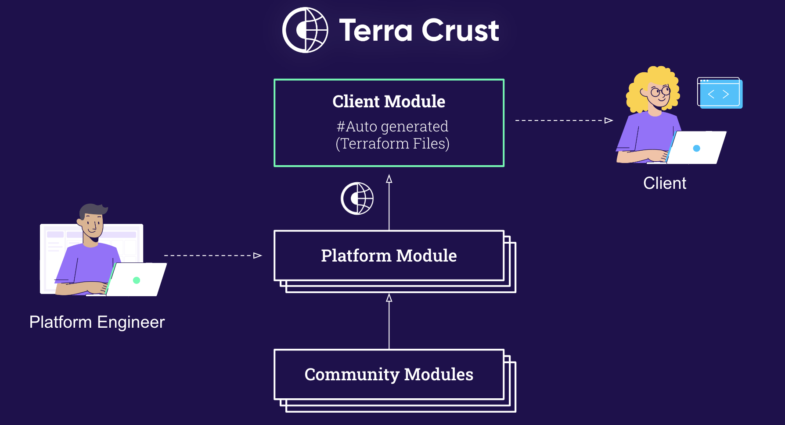

----
Terra crust was created to allow platform teams to expose terraform as the main API communication with the developers, by giving a simple interface in Terraform.
Terraform was adopted as our primary language because it is intuitive, declarative, and community driven.
We wanted to find a way to have an excellent user experience while increasing the platform productivity, moreover to keep it accessible to use and decrease management overhead. 
Our goal in developing terra crust was to hide the system's complexity and provide a simple interface to the client based on Facade Pattern and KISS principles.




## How it works

Terra crust creates a **root module** from existing modules folders inside your terraform project, and exposes all the `variables`,`locals` and `main` used in each module automatically. \
It takes the following components and exports it through 3 files, `local.tf` , `variables.tf`, `main.tf`.
* **local** -  module_local.tf exports the locals of each sub module.
* **variables** - module_variables.tf exports the variables of each sub module.
* **main** - module_main.tf , exports the required variables as commented values in order to fill in by their logical connection. Optional values are genereated automatically by default, also supports an external main template for development.

Terra crust is going over the module folders and extracting from the `Variables.tf` files the defaults values for each variable. \
Every variable that is `Optional` must have a default value in it's variable block, even if there is a merge on the locals that already contains the default. \
Terra crust will release 3 files that wraps all of the existing modules folder under a general module. \
At the end of the flow it will run Terraform FMT to format the files.

## Output Examples:

### Variables:


### Locals:


### Main:


## Commands:
### Create Main:
```
terra-crust terraform-main --destination-path="." --source-path=".../modules"
```
* terra-crust has additional flag: ``main-template-path`` to support external main templates like in examples/templates/main.tf.tmpl
### Create Variables:
```
terra-crust terraform-variables --destination-path="." --source-path=".../modules"
```
### Create Locals:
```
terra-crust terraform-locals --destination-path="." --source-path=".../modules"
```
### Create All:
```
terra-crust terraform-all --destination-path="." --source-path=".../modules"
```
* same as Main has additional flag: ``main-template-path`` to support external main templates like in examples/templates/main.tf.tmpl
* Upon failing on create one of the files , It wont fail the entire flow(Will keep on to the next files).

## Example Usage

Let's look at following terraform project structure:

```
    .               
    ├── main.tf           
    └── modules                   
        ├── moduleA     
        ├── moduleB 
        └── ...
``` 
Terracrust can automatically extract all used varialbes and locals block from the modules folder, to generate a new layer that combines all modules to a single, simplified, root module.
```
    .
    ├── developers_main.tf
    └── root_module
        ├── module_variables.tf                 
        ├── main.tf.tmpl      
        ├── module_locals.tf
        ├── module_main.tf                    
        └── modules                   
            ├── moduleA    
            ├── moduleB 
            └── ...
``` 

### TerraCrust Usage
let's start from the modules layer. Let's say, both modules A and B have the same following variables in them:
```
variable "foo" {
  type        = string
  description = "Optional variable."
  default     = "bar"
}

variable "required" {
  type        = string
  description = "Required variable."
}
```

The main layer above will look samiliar to the following:
```
module "moduleA" {
  source   = "./modules/moduleA"
  required = var.moduleA_requried_value
}

module "moduleB" {
  source   = "./modules/moduleB"
  required = var.moduleB_requried_value
}
```

When you wish to extract this structure to another layer, meaning, have a root module that contains both module A and B respectfully. \
You will need to extract their varialbes to the same main layer, including optional values configured at the module layer, so that their logical connection will not break. 

When looking at this example, it's pretty simple to do this manually, but what about cases when you have over 10 modules to manage, and each module contains 10 different/similiar variables. This can lead to managing over 100 varialbes in total, copying and pasting them with the same logical structure.

This is where TerraCrust comes in place, by providing a path to the modules folder, TerraCrust will automatically extract and organize a `module_variables.tf`, a `module_locals.tf` as well as a `module_main.tf`, with all the modules default variables in them.

Each module's variables is looked as an object, containing all it's optional variables and their optional values respectfully under `module_varialbes.tf`:
```
variable "moduleA" {
  type = object({
    foo = optional(string) # The variable name and type
  })
  default = {
    foo = "bar" # The default found in the module folder
  }
}

variable "moduleB" {
  type = object({
    foo = optional(string)
  })
  default = {
    foo = "bar"
  }
}
```

`module_locals.tf`, each variable in every module object has a coalesce block that either uses the default value provided at the module level, or if a user entered a different default value, the locals will take it to account:
```
locals {
  moduleA = {
    foo = coalesce(var.drain_cleaner.foo, "bar")
  }
  moduleB = {
    foo = coalesce(var.drain_cleaner.foo, "bar")
  }
}
```
`module_main.tf`, which contains all the connection to the default values, as well the required variables needed to be filled before apply will also be generated:
```
module "moduleA" {
  source   = "./modules/moduleA"
  required = #TO DO: fill requried variable

  foo = local.moduleA.foo
}

module "moduleB" {
  source   = "./modules/moduleB"
  required = #TO DO: fill requried variable

  foo = local.moduleB.foo
}
```

Leaving the users to use a single ready module, combining everything in a simple way using the following structure like `developers_main.tf`:
```
module "root_module" {
  source = "./root_module"
  moduleA {
    requried = "user_input"
  }
  moduleB {
    requried = "user_input"
    foo      = "foobar" # example of changing default value.
  }
}
```
Saving time for platform teams extracting every module variable manually, and providing developers a simple, singular module to use without the need to deep dive on how each module works.

### Map type values usage
When using map type variables. Use the following structure.
under `variables.tf` in the module level:
```
variable "map_varialbe" {
  type = map(string)
  default = {
    "keyA" = "valueA",
    "keyB" = "ValueB",
    "KeyC" = "ValueC"
  }
}
```
Create a map type variables with it's default values.

under `locals.tf`:
```
locals {
  map_varialbe = merge(
    tomap({
      "keyA" = "valueA",
      "keyB" = "ValueB",
      "KeyC" = "ValueC"
    }),
    var.map_varialbe,
  )
}
```
Create a tomap function, so when a user changes a value at the top level, it will not earase all other keys in the map.


### Working with main template usage

TerraCrust also give the ability to use a ready main.tf template, that contains all module required variables dependencies, without changing them for every run.

Simply take your ready made main.tf, with it's logical dependencies, and change the end of the file to `main.tmpl`. Add the following lines in the place you wish to add the default values to:

```
module "moduleA" {
  source = "./modules/moduleA"
  required = var.moduleA_User_Input
  
  {{(GetDefaults "moduleA" .)}}
}

module "moduleB" {
  source   = "./modules/moduleB"
  required = module.moduleA.output

  {{(GetDefaults "moduleB" .)}}
}
```
The function GetDefaults, will add the optional values to each module block, without chainging the required values. It uses the name of the module folder give under `source`.

Example, this `module_main.tf` will get generated:
```
module "moduleA" {
  source = "./modules/moduleA"  
  required = var.moduleA_User_Input  # Remains the same
  
  foo = local.moduleA.foo # Gets added automatically
}

module "moduleB" {
  source   = "./modules/moduleB"
  required = module.moduleA.output  # Remains the same

  foo = local.moduleB.foo # Gets added automatically
}
``` 

## Contribution
In order to contribute, please make sure to test and validate that everything is working, including lint ci, open a merge request and wait for approval.